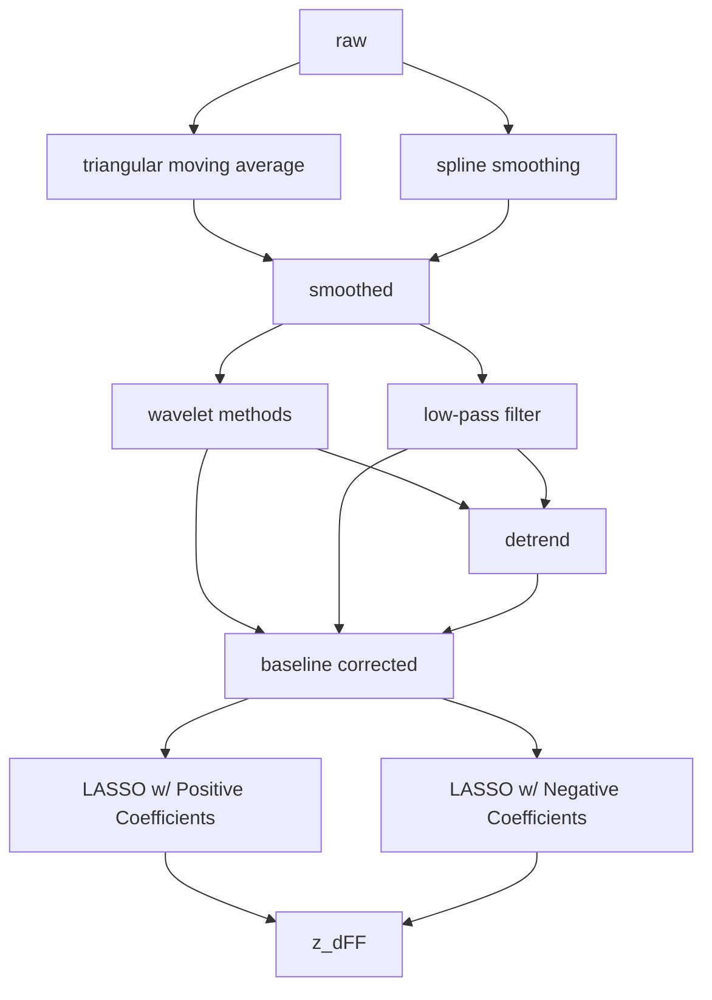

## Pre-Processing Pipeline for Photometry Data

This pipeline is intended to be used in the pre-processing of photometric data, specifically on data sets where the experiment records (simultaneously) from a signal channel and a reference or control channel, which is expected to have nearly identical motion artifacts to the 'true' signal channel.

Author: Cameron Jordan

**Index**
1. [Usage](#usage)
2. [Methods](#methods)
    2.1 [Primary Methods](#primary-methods)
    2.2 [Auxiliary Methods](#auxiliary-methods)
    2.3 [Utility Methods](#utility-methods)
3. [Theory](#theory)
    3.1 [Triangular Moving Average](#triangular-moving-average)
    3.2 [Spline Smoothing](#spline-smoothing)
    3.3 [Wavelet Methods](#wavelet-decomposition-and-reconstruction)
    3.4 [OLS](#ordinary-least-squares-regression-ols)
    3.5 [LASSO](#lasso-regression)

### Usage

**Minimal Working Example**

```python
'''Assume the time data lies in an array called timeseries, the signal data lies in signal and the control channel lies in reference'''

''' Construct a Preprocess object '''

data = Preprocess(timeseries, signal, reference)

''' Construct a Pre-Processing Pipeline
- smoothing using triangular moving average
- determining baseline using low-pass filtering
- fitting reference to signal using 
'''

data.pipeline('tma','lpf','l')
```

**Usage/Method Selection Flowchart**



### Methods

#### Primary Methods:

**Preprocess Constructor**:
    *Initialize a Preprocess Object*

    Parameters:
        timeseries            : Sequence of Data Points Over a Time Variable
        
        signal                : Values of the Signal Over the Above timeseries                
        
        reference             : Values of the Reference Signal Over the Above timeseries

        positive_coefficients : Indicates Whether the LASSO Regression Can Have Positive Coefficients; boolean
            
        sampling_frequency    : Sampling Frequency of the Equipment
        
        drop                  : Number of Initial Frames to Drop
            
        window_size           : Desired Window Size for Triangular Moving Average Smoothing
            
        r_squared_threshold   : r_squared Cutoff Value for Baseline Similarity

**pipeline**:
    *Constructs a Pre-Processing Pipeline*

    Parameters:
        smoothing_method : Method to Pass to self.smooth(); string-type
            - tma [triangular_moving_average]
            - ss  [smoothing_spline]
        
        baseline_method  : Method to Pass to self.compare_and_baseline() [and self.baseline() if detrend_last == True]; string-type
            - w   [wavelet]
            - lpf [low_pass_filter]
        
        fit_method       : Method to Pass to self.fit(); string-type
            - l    [lasso] 
        
        detrend_last     : Indicates Whether to Detrend After Subtracting self.fitted_ref From self.detrended_signal
                
        ax               : Axis to Pass to _visualize; plt.gca() object

    Returns:
        self.z_dFF       : Normalized, Filtered, Baseline-Corrected signal Channel

**smooth**:
    *Apply Selected Smoothing Function to Signal*

    Parameters:
        method : string-type
            - tma [triangular_moving_average]
            - ss  [smoothing_spline]

        Returns:
            self.smoothed_signal : array-like
            self.smoothed_ref : array-like

**compare_and_baseline**:
    *Apply Selected Baseline Determination Function to Signal*

    * Determines Baseline Signal using Selected Determination Function
    * If signal_baseline Significantly Differs From reference_baseline
        * Detrend Both self.signal and self.reference
        * Return detrended_signal and detrended_reference
    * Else
        * Return self.signal and self.reference

    Parameters:
        method : string-type
            - w   [wavelet]
            - lpf [low_pass_filter]

        Returns:
            self.detrended_signal : array-like
            self.detrended_ref : array_like

**baseline**:
    *Apply Selected Baseline Determination Function to Signal*

    * Determines Baseline Signal using Selected Determination Function
    * Detrend Both self.signal and self.reference

    Parameters:
        method : string-type
            - w   [wavelet]
            - lpf [low_pass_filter]

    Returns:
        detrended_signal : array-like

**fit**:
    *Fit the Reference Signal to the Signal*

    Parameters:
        method : string-type
            - l    [lasso]

    Returns:
        self.z_fitted_ref : array-like

#### Auxiliary Methods

**triangular_moving_average**:
    *Applies a Triangular Moving Average to signal*

    Parameters:
        signal : Signal to be Smoothed; array-like

    Returns:
        smoothed_signal : Triangular Moving Average Smoothed Signal; array-like

**wavelet_baseline**:
    *Applies a Wavelet Decomposition (to the lowest frequency component), Then Reconstructs the Baseline Component*

    Parameters:
        signal  : Signal Whose Baseline is to be Determined; array-like
        
        wavelet : Wavelet to Use in Decomposition/Reconstruction; string-type

    Returns:
        baseline : Signal Baseline (as determined by wavelet methods); array-like

**lpf_baseline**:
    *Applies a Low-Pass Filter to the Signal to Determine the Low Frequency (Baseline) Components*

    Parameters:
        signal : Signal Whose Baseline is to be Determined; array-like
        
        cutoff : LPF Cut-Off Frequency; float

    Returns:
        baseline : Signal Baseline (as determined by lpf); array-like

#### Utility Methods
**_visualize**:
    *Visualize the Specified Signal using matplotlib*

    Parameters:
        signal : The Signal Data to be Visualized; array-like
        
        title  : Title of the Plot; array-like, string-type
        
        ax     : Axis to Plot signal On; plt.gca() object

**_visualize_psd**:
    *Visualize the Power Spectral Density of the Specified Signal using matplotlib*

    Parameters:
        signal : The Signal Whose Power Spectrum is to be Visualized; array-like
        
        title  : Title of the Plot; array-like, string-type
        
        ax     : Axis to Plot signal On; plt.gca() object

### Theory

#### Triangular Moving Average


#### Spline Smoothing

Consider the observational regression model: $$y_i = f(x_i) + \epsilon_i, \ i = \overline{1, n},$$ with $\epsilon = (\epsilon_1, ..., \epsilon_n)'$ ~ $N(0, \sigma^2I)$ and the data, $y_i$, having the weights $w_i, w_i > 0$.

A non-parametric model doesn't make assumptions about the shape of the estimator, but about the "quality" of the estimator, which generally refers to some general properties such as smoothness. Moreover, if the data is noisy, then it is more appropriate to find an estimator that is not very close to the data (point by point) but instead is sufficiently smooth; such an estimator will minimize the following expression: $$\sum_{i=1}^n w_i(y_i-f(x_i))^2 \ + \ \lambda \int_a^b(f^{(m)}(x))^2, \ \lambda \geq 0, \ [x_{min}, x_{max}] \subseteq [a,b]$$
where $m$ in the integral represents the $m$ th derivative, and therefore the order of the smoothing spline.

- The summation term represents the *goodness-of-fit* to the data, often known as the penalized least squares criteria
- The integral represents the *smoothness of the estimator*

Note: The implemented spline smoothing method (scipy.interpolate.make_smoothing_spline) determines the penalizing factor (smoothing factor) using a GCV (Generalized Cross Validation) method.

Credit: [The Cross Validation Method in the Smoothing Spline Regression](https://www.emis.de/journals/AUA/pdf/49_539_nicoleta_breaz-2.pdf)

#### Wavelet Decomposition and Reconstruction


#### Low-Pass Filtering


#### Ordinary Least Squares Regression (OLS)


#### LASSO Regression


